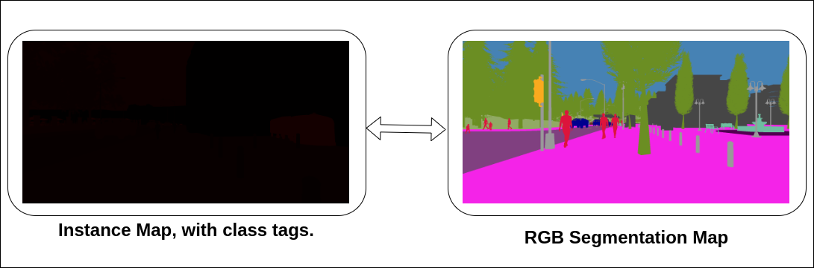

# Convert-Image-Maps
For converting instance maps to RGB semnatic segmantion maps or vice-versa.

`inst_to_rgb.py`: converts instance image maps to RGB segmentation maps. 'color' array in the script is a list of color lables for each class numerically arrnaged w.r.t each class number tag. 
               
<td></td>


## Install Requirements

Install python packages from requirements.txt
```
pip install -r requirements.txt
```
## Usage 
```
python inst_to_rgb.py --path <datapath> --imagewidth <size> --imageheight <size> --savepath <datapath>

```
